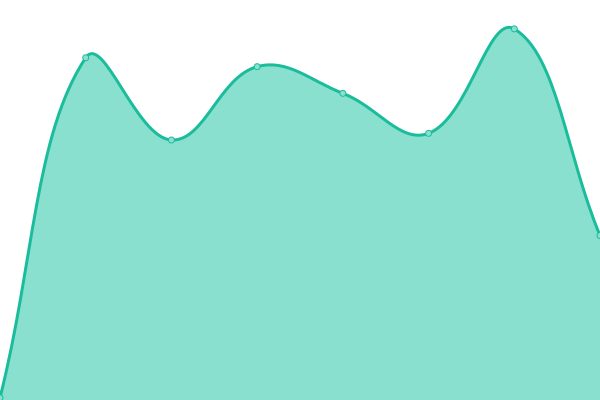
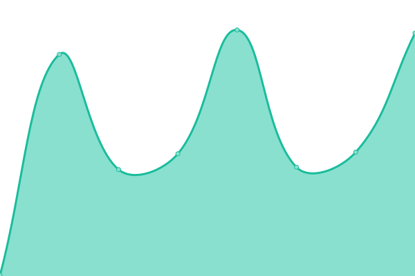
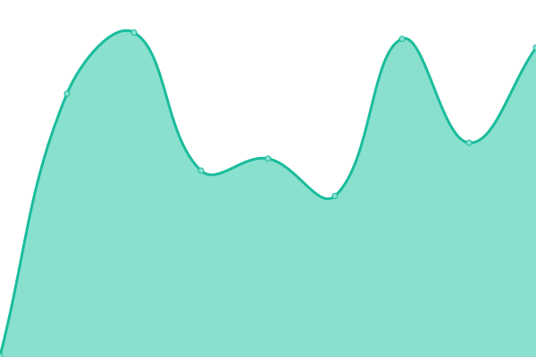

# [📈 Live Status](https://morganestes.me): <!--live status--> **🟧 Partial outage**

This repository contains the open-source uptime monitor and status page for [Morgan Estes](https://morganestes.com), powered by [Upptime](https://github.com/upptime/upptime).

With [Upptime](https://upptime.js.org), you can get your own unlimited and free uptime monitor and status page, powered entirely by a GitHub repository. We use [Issues](https://github.com/morganestes/uptime-monitor/issues) as incident reports, [Actions](https://github.com/morganestes/uptime-monitor/actions) as uptime monitors, and [Pages](https://morganestes.me) for the status page.

<!--start: status pages-->
<!-- This summary is generated by Upptime (https://github.com/upptime/upptime) -->
<!-- Do not edit this manually, your changes will be overwritten -->
<!-- prettier-ignore -->
| URL | Status | History | Response Time | Uptime |
| --- | ------ | ------- | ------------- | ------ |
|  [Blog](https://morganestes.com) | 🟩 Up | [blog.yml](https://github.com/morganestes/uptime-monitor/commits/HEAD/history/blog.yml) | 

 184ms
     
 | 

<a href="https://morganestes.github.io/uptime-monitor/history/blog">100.00%</a>
    

|  [Site Hosting](https://sites.estestech.net) | 🟥 Down | [site-hosting.yml](https://github.com/morganestes/uptime-monitor/commits/HEAD/history/site-hosting.yml) | 

 0ms
     
 | 

<a href="https://morganestes.github.io/uptime-monitor/history/site-hosting">0.00%</a>
    

|  [The Lump](https://thelump.estes.pw) | 🟩 Up | [the-lump.yml](https://github.com/morganestes/uptime-monitor/commits/HEAD/history/the-lump.yml) | 

 284ms
     
 | 

<a href="https://morganestes.github.io/uptime-monitor/history/the-lump">100.00%</a>
    

|  [The Lump Saga](https://thelumpsaga.estes.pw) | 🟩 Up | [the-lump-saga.yml](https://github.com/morganestes/uptime-monitor/commits/HEAD/history/the-lump-saga.yml) | 

 276ms
     
 | 

<a href="https://morganestes.github.io/uptime-monitor/history/the-lump-saga">100.00%</a>
    

|  [Home Lab](https://35735.uk) | 🟥 Down | [home-lab.yml](https://github.com/morganestes/uptime-monitor/commits/HEAD/history/home-lab.yml) | 

 0ms
     
 | 

<a href="https://morganestes.github.io/uptime-monitor/history/home-lab">0.00%</a>
    

<!--end: status pages-->

[**Visit our status website →**](https://morganestes.me)

## 📄 License

- Powered by: [Upptime](https://github.com/upptime/upptime)
- Code: [MIT](./LICENSE) © [Morgan Estes](https://morganestes.com)
- Data in the `./history` directory: [Open Database License](https://opendatacommons.org/licenses/odbl/1-0/)
